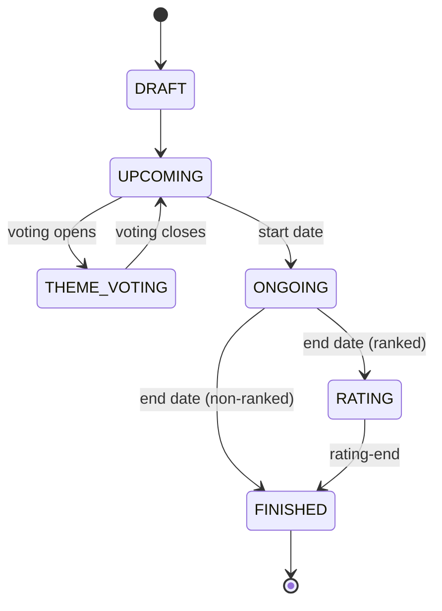

# GameJam Organizer — Product Specification

This is the full-scope product specification for the GameJam Organizer platform. It is the
superset from which the MVP artifacts are drawn: [requirements.md](./requirements.md) (EARS
requirements) and [design.md](./design.md) (technical design) cover only the MVP subset, while
this document describes the complete product vision, including features planned beyond the MVP.

It supersedes the free-form brainstorm in [DRAFT.md](./DRAFT.md), which is retained for
historical reference.

## Reading this document

- **[MVP]** marks behaviour that is part of the initial release and already specified in the
  MVP requirements/design.
- **[Future]** marks behaviour that is planned but deferred beyond the MVP.
- Blocks introduced by **`OPEN QUESTION`** mark decisions that are not yet settled. These are
  collected in the [Open Questions](#open-questions) index at the end and are resolved
  incrementally. Nothing under an open question should be treated as final.

---

## 1. Terminology

### Platform roles

Platform staff are governed by a **permission-based** system rather than a fixed Admin/Moderator
split: every staff action checks a specific permission, and roles are named bundles of
permissions.

- **Super Admin** — holds every permission, including managing staff and roles.
- **Moderator** — holds a safe, mostly reversible subset (content moderation). **[Future]**

The powers of each role are defined by the permission catalog in
[Section 10](#10-platform-administration--moderation).

### Jam roles

- **Jam Admin** — has all permissions for a jam: editing the jam, managing submissions,
  managing users, and assigning roles. The creator of a jam is an Admin by default.
- **Jam Moderator** — can manage submissions (edit, disqualify, hide, delete) but cannot edit
  the jam itself or manage users.
- **Judge** — may rate submissions even without having submitted a game, but cannot edit
  anything.
- **Host** — credited as a host of the jam, with no additional permissions.
- **Organizers** — the collective term for everyone involved in managing a jam.

### Jam participation

- **Joined** — a user who has joined a jam, signalling they intend to take part, but who is not
  yet part of a submission.
- **Participant** — a joined user who is part of a submission (as submitter or contributor), and
  so is actually taking part in the jam.

### Submissions and teams

- **Submission** — a game submitted to a jam. Each submission has exactly one submitter and may
  have multiple contributors.
- **Submitter** — the user who created the submission.
- **Contributor** — a user who is part of a submission but did not create it. Contributors have
  the same permissions over the submission as the submitter and are not identified differently
  in public views.
- **Team** — a submission that has at least one contributor in addition to the submitter. There
  is no separate "Team" entity; a submission *is* the team.
- **Team Leader** — the member responsible for the submission. The submitter is the team leader
  by default, and leadership can be transferred to another member.

### Rating

- **Rating** — a score given to a submission during a jam's rating period.
- **Criterion** — a named dimension on which submissions are rated (e.g. "Gameplay").
- **Voting** — the process of selecting a theme (or other aspect of a jam) through community
  voting.

---

## 2. Platform overview

The GameJam Organizer is a website for creating, running, and participating in game jams —
time-boxed events where people build games, usually around a theme.

### Core principles

- **Entirely free.** The platform is free to use for all users.
- **No user assets hosted.** Profile pictures, cover images, screenshots, and game files are
  never stored on platform servers. Users reference their own hosting or third-party services
  (e.g. itch.io, Imgur, GitHub) via external URLs.

### Feature summary

- Browse and search jams of any status. **[MVP]**
- Organize jams. **[MVP]**
- Submit games to jams. **[MVP]**
- Rate submitted games. **[MVP]**
- Register through Discord. **[MVP]**
- A calendar of upcoming jams. **[Future]**
- Email reminder notifications (start, voting, results, etc.). **[Future]**
- Vote on jam themes. **[Future]**

---

## 3. User accounts

### Registration and sign-in

Users register and sign in using:

- Discord OAuth. **[MVP]**
- Email and password. **[MVP]**
- Google OAuth. **[Future]**
- GitHub OAuth. **[Future]**

When a user registers via OAuth, setting an email and password is optional. Users can link
additional providers later and sign in with any linked method (**account merging**). Attempting
to link a provider already associated with a different account is rejected with a conflict
error.

Each user chooses a unique **username** at registration (lowercase alphanumeric plus hyphens
and underscores). This is distinct from the display name and is used in profile URLs.

### Profile

A user profile stores and displays:

- Username (unique).
- Display name.
- Bio.
- Profile picture (external URL).
- The jams they created or participated in, with their role (admin / moderator / judge / host).
- The submissions and teams they participated in.

### What a user can do

- Create a jam.
- Join a jam.
- Submit a game to a jam.

---

## 4. Game jams

### 4.1 Basic information

- Name.
- Short description.
- Vanity URL (slug), unique across the platform.
- Full description, with Markdown support.
- Cover image (external URL).
- Submission details — shown at the top of the submission dialog as an entrant adds their game.
- Social media hashtag — entrants are prompted to use it when talking about the jam or their
  submissions.
- Tags — used for filtering and discovery on the jam listing. Organizers may enter custom tags
  when no suitable suggestion exists.

**Rich text.** The full description and every other description field render sanitized
GitHub-Flavored Markdown. Raw HTML is escaped rather than rendered, and link and image URLs are
restricted to `http`, `https`, and `mailto` schemes — no scripts, iframes, inline event
handlers, or inline styles. Because dedicated fields already cover cover images and video links,
inline HTML is unnecessary. **[MVP]**

As a later enhancement, known video providers referenced in the video-link field may be
auto-embedded through a platform-rendered iframe (never from user-supplied HTML). **[Future]**

### 4.2 Settings

- **Ranked or non-ranked.**
- **Dates and times:**
  - Start of the jam.
  - End of the jam (which is also the start of the rating period for ranked jams).
  - End of the rating period (ranked jams only).
- **Theme** (optional) — see [Section 6](#6-themes).
- **Community** — a message board for the jam, accessible from the jam page. **[Future]**
- **Hide results** — when enabled, results stay hidden from the public even after the rating
  period ends, letting organizers reveal them manually. (Ranked jams only.)
- **Hide submissions before end** — the submission list is hidden from the jam page until the
  submission period is over. Individual submissions remain reachable by direct URL or from a
  member's profile.

### 4.3 Visibility

Visibility controls listing only and is independent of a jam's status:

- **Public** — listed on the jam listing page and discoverable.
- **Unlisted** — not listed, but reachable by direct URL.

New jams default to **Unlisted** and start in **DRAFT**. A **Publish** action sets visibility
to Public once the jam has valid dates, making it discoverable. Both public and unlisted jams
progress through the lifecycle identically once dates are set.

### 4.4 Lifecycle and status

A jam moves through these statuses in order, each beginning the moment the previous one ends:

```text
DRAFT → UPCOMING → (THEME_VOTING) → (UPCOMING) → ONGOING → (RATING) → FINISHED
```

Parentheses mark conditional phases: `(THEME_VOTING)` and the return to `(UPCOMING)` appear only
when theme voting is enabled, and `(RATING)` only for ranked jams.



- **UPCOMING** ends and **ONGOING** begins at the start date.
- **ONGOING** ends at the end date; for ranked jams **RATING** then begins, for non-ranked jams
  **FINISHED** begins directly.
- **RATING** ends and **FINISHED** begins at the rating-end date (ranked jams only).

Status is derived from the jam's dates rather than transitioned manually:

- No start/end dates set → **DRAFT**.
- Now is before the start date → **UPCOMING**.
- Now is between start and end → **ONGOING**.
- Ranked, now is between end and rating-end → **RATING**.
- Ranked and now is past rating-end, or non-ranked and now is past end → **FINISHED**.

Dates cannot overlap or be out of order: start must precede end, and (for ranked jams) end must
precede rating-end. Invalid date orderings are rejected.

**THEME_VOTING** is not a phase in this chain but a **window inside UPCOMING** (see
[Section 6.2](#62-theme-voting-future)). While a jam's theme-voting window is open — which must
fall entirely before the start date — its status reads **THEME_VOTING**; once the window closes,
the status returns to **UPCOMING** until the jam starts. **[Future]**

Users may join a jam (become **Joined**) while it is UPCOMING (including its THEME_VOTING window)
or ONGOING; see [Section 4.7](#47-participation).

### 4.5 Submission settings

- **Max team size** (optional) — no limit if unset.
- **Allow contributors after submissions close** — whether contributors may still be added once
  the submission period ends (see [Section 8](#8-submissions--teams) for the exact window).
- **Custom submission fields** — organizer-defined fields collected with each submission. To
  keep responses consistent, fields should not be changed during the submission period, and
  cannot be changed once it is over. Each field has:
  - Name (e.g. "Game Engine Used").
  - Description.
  - Type (single-line, multi-line, URL).
  - Required or optional.
  - Public or private — private fields are visible only to organizers and judges.

### 4.6 Jam permissions

Jam access is **permission-based**, mirroring platform staff (see
[Section 10](#10-platform-administration--moderation)): a hardcoded catalog of jam permissions
(edit jam, manage roles, moderate submissions, rate as a judge, and so on) is enforced in code,
and the named roles below are **seeded bundles** of those permissions.

Roles are **stackable** — a user may hold several at once, and their effective powers are the
union of their roles' permissions:

- **Admin** — every jam permission: edit the jam and any submission, and manage roles. The
  creator is always an Admin and cannot be demoted.
- **Moderator** — edit, disqualify, hide, and delete submissions, but not edit the jam.
- **Judge** — rate submissions even without a submission of their own.
- **Host** — a credit only, with no permissions; stacks with any other role.

A per-jam **custom-role builder** (organizers defining their own roles) is **[Future]**;
because enforcement is permission-based, it can be added later with no rewrite.

### 4.7 Participation

A user's relationship to a jam has three states:

- **Not joined** — the default.
- **Joined** — the user joined the jam, signalling intent to take part, but is not yet in a
  submission.
- **Participant** — a joined user who is part of a submission (as submitter or contributor).

Transitions and rules:

- **Join** (Not joined → Joined) is allowed while the jam is UPCOMING (including its
  THEME_VOTING window) or ONGOING — that is, until submissions close. **[MVP]**
- **Leave** (Joined → Not joined) is allowed only while the user is not a Participant in a locked
  submission and has not cast a theme vote. Once a user has voted on the theme they are locked in
  so the tally stays honest; if the jam has no theme voting, that condition does not apply.
  **[MVP]** (the theme-vote lock is **[Future]**)
- **Enter** (Joined → Participant) happens when the user creates or is added to a submission.
- **Leave a submission** (Participant → Joined) is allowed only while the jam is ONGOING, since
  submissions and contributors freeze at close (see
  [Contributor change window](#contributor-change-window)). Once the jam is in RATING or FINISHED
  a user cannot remove their Participant status. A team leader must first transfer leadership or
  delete the submission in order to leave. **[MVP]**

---

## 5. Ranked jams

This section applies only to ranked jams.

### 5.1 Who can rate

Organizers choose the rating audience:

- **Submitters only** — only team leaders.
- **Submitters and contributors** — every member of a team.
- **Judges** — only users with the Judge role.
- **Everyone** — any authenticated user.

### 5.2 Criteria

Each rating criterion has:

- Name.
- Description (optional).
- Weight (optional) — used to compute final scores; defaults to 1. A weight of 0 collects
  ratings without contributing to the score. A ranked jam must have at least one criterion with
  a non-zero weight.

### 5.3 Rating process

During the rating period, eligible users rate each criterion on a scale of **1 to 5**. Users
cannot rate a submission they are part of. Ratings are **anonymous** — neither submitters nor
the public can see who rated what. Ratings can be updated while the rating period is open.

### 5.4 Scoring and ranking

Scores use a **Bayesian average** so that a submission with a single 5/5 rating does not
outrank a well-rated submission with many ratings. Each submission has a **raw score**
(a plain arithmetic mean) and a **weighted score** (the Bayesian, weight-adjusted value);
only the weighted score is used for ranking.

For each criterion `c` with weight `w > 0`:

$$WS_c = \frac{v \times R_c + m \times C_c}{v + m}$$

where `v` is the number of ratings for the submission on `c`, `R_c` is the submission's mean on
`c`, `C_c` is the global mean on `c` across all submissions, and `m` is a tuning parameter (the
median number of ratings per submission).

The final score is the weighted mean across scoring criteria:

$$\text{FinalScore} = \frac{\sum (WS_c \times w_c)}{\sum w_c}$$

Ties are broken in order:

1. Higher total number of ratings received.
2. Higher raw average score.
3. A deterministic random selection between the tied submissions.

### 5.5 Results

When a ranked jam reaches **FINISHED** and "hide results" is not enabled, rankings are shown
publicly — each submission's final score, rank, and per-criterion scores. While "hide results"
is enabled, rankings are visible only to organizers until they choose to reveal them.

Submissions that are rank-excluded (disqualified, otherwise excluded, or non-promoted late
entries) are not ranked; if they were rated, they appear in a separate "Not competing" section.

### 5.6 Rating incentives **[Future]**

To ensure even, fair coverage — so obscure entries are not ignored while popular ones pile up
ratings — the platform uses a **rating queue** rather than a karma system. (A karma system that
grants more visibility the more you rate is deliberately avoided: it makes ranking exposure
depend on rating volume rather than quality, and does not guarantee coverage.)

When rating opens, the queue serves each rater submissions they can play, **least-rated first**,
excluding their own and any they have already rated. Raters set their playable platforms once,
matched against each submission's declared supported platforms.

If the organizer enables **"require queue,"** a rater must rate a configurable minimum number of
queued submissions before rating freely; otherwise the queue only suggests an order. This setting
is off by default.

Active raters may optionally be recognized (for example a "top rater" mention), but such
recognition has **no effect on visibility or ranking**.

---

## 6. Themes

This section applies only to jams that use a theme, whether the organizer sets it manually or the
community votes on it.

**Reveal.** The `revealThemeOnStart` toggle governs when the decided theme becomes visible, for
both manual and voted themes:

- **On (default)** — the theme stays hidden until the jam starts, even if it was decided earlier.
- **Off** — the theme is revealed as soon as it is decided (the moment an organizer sets it, or
  the moment theme voting closes), so a jam can sit in UPCOMING with its theme already shown.

### 6.1 Manual theme **[MVP]**

An organizer sets a single theme directly.

### 6.2 Theme voting **[Future]**

Instead of setting the theme directly, an organizer can let the community vote among a list of
theme options (at most **20**). The organizer sets a voting **start** time and an optional **end**
time (defaulting to the jam start); the window must fall entirely before the jam starts and, while
open, puts the jam in the **THEME_VOTING** status (see
[Section 4.4](#44-lifecycle-and-status)).

Only **Joined** users may vote (see [Section 4.7](#47-participation)). Votes are private
(aggregate-only) and can be updated while voting is open.

**Voting method — score voting.** Each voter scores **every** option from 1 to 5; scoring all
options is mandatory. Because every option therefore receives the same number of votes, the
winner is simply the option with the highest **average** score — no Bayesian adjustment is needed.
Ties are broken by: most top scores (5s) → fewest bottom scores (1s) → deterministic random.

The winning option becomes the jam's theme, revealed according to the `revealThemeOnStart` toggle
above. Per-option averages become visible once voting closes.

Additional voting methods (for example Approval voting, or score voting where scoring every option
is optional — which would reintroduce a Bayesian or threshold guard) are a later enhancement.

---

## 7. Prizes **[Future]**

This section applies only to ranked jams.

Organizers can list prizes and assign each to a place (1st, 2nd, 3rd, and so on). Prizes are an
**intent** only — the platform does not manage or deliver anything; it records what organizers
intend to give. When multiple prizes exist for the same place, members of the winning team can
declare who receives what, so organizers know how to distribute them.

> **OPEN QUESTION — OQ-5 (Prizes model).** The intent-only model and the per-place /
> winner-declaration flow need to be confirmed and detailed. See [OQ-5](#oq-5-prizes-model).

---

## 8. Submissions & teams

A submission is the unit of participation, and each submission can have multiple contributors —
that group is the team. The submitter is the team leader by default.

A submission has:

- Title.
- Description, rendered as sanitized Markdown (see [Section 4.1](#41-basic-information)).
- Cover image (external URL).
- Game link: a single **itch.io project URL**, validated against the itch.io URL pattern. This
  is the game entry; per-platform builds (Windows, Mac, Linux, Web) live on the itch.io page.
  Supporting other hosts and separate per-platform link fields is a **[Future]** expansion.
- Supported platforms: a multi-select of Windows, Mac, Linux, and Web declaring what the game
  runs on. Shown on the submission, and used to filter the rating queue.
- Screenshots (external URLs).
- Video link (e.g. YouTube, Twitch).
- Any custom fields defined by the jam organizers.

### Submission lifecycle

A submission has two statuses:

- **DRAFT** — being created or edited. Visible only to the team and organizers; not part of the
  jam and not rateable.
- **SUBMITTED** — ownership-verified and required fields complete; publicly visible (subject to
  jam settings) and rateable once rating opens.

A submission can only move to **SUBMITTED** once its itch.io project link is verified (see
[Ownership verification](#ownership-verification)) and required fields are filled, and only
before the submission deadline — the one exception being a late-submission invite (see
[Late submissions](#late-submissions-future)), which lets a DRAFT reach SUBMITTED after close.
If the submitter later changes the verified link, the submission returns to **DRAFT** until it is
re-verified.

Withdrawing an entry is done by deleting the submission; there is no separate withdrawn status.

### Contributors and team leadership

- Members can invite other joined users to their submission as contributors. Contributors
  have the same permissions as the submitter and are not identified differently in public views.
- Exactly one member is the **team leader** — the submitter by default. Leadership can be
  transferred to another member.
- When rating is restricted to submitters only, only the team leader can rate on the team's
  behalf.
- A user can belong to only **one submission per jam**, but may participate in different
  submissions across different jams.

### Contributor change window

Contributors can be freely added and removed during the submission period, while the submission
is editable. When the submission period ends, the roster **freezes** — no additions or removals
for the rest of the jam.

If the jam enables **"allow contributors after submissions close,"** contributors may still be
**added (never removed)** after the submission period, up to the end of the jam:

- For a **ranked** jam, additions are allowed during the RATING period, until the rating period
  ends.
- For a **non-ranked** jam the setting has no effect, since the jam ends the moment submissions
  close.

Removal is never permitted after close, to prevent denying a member credit or a prize share.
Additions after close still require the invitee to accept and remain bounded by any max team
size. Because adding a contributor can grant rating rights when eligibility includes
contributors, organizers who want a fixed rating electorate should leave this setting off.

### Moderation

Moderation is expressed through three independent switches on a submission, so states compose
cleanly:

- **Visible** — whether the submission appears on the jam page (`hidden` removes it while
  retaining its data).
- **Rateable** — whether people can submit ratings for it.
- **Competing** — whether it counts in the official ranking (`rank-excluded` removes it from the
  ranking).

Jam admins and moderators act through these presets:

- **Disqualify** — for rule-breaking or cheating: the submission stays visible with a
  "Disqualified" badge and a reason, but is both **rank-excluded and rating-disabled** (cannot
  be rated, cannot win). **[MVP]**
- **Exclude from ranking** — a softer action: the submission stays visible and **still
  rateable** (so it can gather feedback), but is **rank-excluded** (does not compete). Shown
  with a "Not competing" badge. **[MVP]**
- **Hide** — removed from the jam page while its data is retained. **[MVP]**
- **Delete** — removed entirely. **[MVP]**

Excluded and non-competing submissions still appear in results, with their scores if rated, in a
separate "Not competing" section rather than interleaved with the ranked entries.

### Ownership verification

Because the platform hosts only links, not content, every submission must prove the submitter
controls the linked game before it can be published. Verification is **mandatory**: an unverified
submission stays in **DRAFT** (see [Submission lifecycle](#submission-lifecycle)) and never
appears in the jam. There is no "verified" badge, since an unverified entry is simply not
published.

Verification anchors on itch.io, which the platform relies on for the MVP.

**Per-project code (MVP).** The submitter provides their itch.io project URL, the platform issues
a unique code bound to that submission, URL, and user, and the submitter places the code on the
itch.io project page. A "verify" action fetches the page and confirms the code is present. If
automated verification cannot succeed (for example a temporary fetch failure), a jam admin or
moderator can **manually mark the submission verified** as a fallback. **[MVP]**

**Verified itch.io profile (later).** A user links their itch.io profile once — proven with the
same code-on-page mechanism, placed on their profile page — after which any project under that
profile is verified automatically (matched by the project's `username.itch.io` namespace and
author byline), with no per-project code. **[Future]**

Because the MVP only ever fetches itch.io URLs, the fetcher uses a **single-host allowlist**
(`itch.io` and `*.itch.io`) over HTTPS, with a request timeout and a response-size cap. The
broader safeguards against server-side request forgery (SSRF) — blocking private and link-local
address ranges, re-validating the resolved address on each redirect, and capping redirects —
become required when arbitrary hosts are supported alongside separate per-platform links.
**[Future]**

### Late submissions **[Future]**

After the submission window closes, a jam admin or moderator can allow a late entry by generating
a **one-time invite link** (single-use, expiring) and sharing it with the user. Opening
the link reopens the normal submission form for that one entry, so a late submission goes through
the **same flow as any other submission**, including ownership verification (see
[Ownership verification](#ownership-verification)) — it is simply flagged **Late**.

A late submission is **rank-excluded by default** (feedback-only: visible and rateable, but not
in the ranking). A jam admin can **promote it to competing**, which clears the rank exclusion.

A targeted per-user grant (issuing the invite to a specific account rather than a shareable
link) is a later enhancement.

---

## 9. Notifications **[Future]**

The platform sends email reminders for key jam events (start, voting, results, and similar).

> **OPEN QUESTION — OQ-10 (Notifications).** The exact set of notified events, who can
> configure them, and what organizers can send is undefined. (This also completes the
> truncated "Jam organizers can…" note from the original draft.) See
> [OQ-10](#oq-10-notifications).

---

## 10. Platform administration & moderation

Platform staff manage the site itself — handling abuse, illegal content, and account problems.
Because the platform stores only links, moderation focuses on removing or hiding content and
acting on accounts, not on hosted files.

### Permission-based access control

Staff powers are enforced by **permissions**, not by a person's title. Each sensitive action is
guarded by a specific permission, and the code always checks the permission — never "is this
user an admin." Permissions are a **hardcoded catalog** in the codebase, for example:

- Edit any jam; delete any jam.
- Remove, hide, or restore any submission.
- Highlight or feature a jam.
- Suspend, ban, or delete a user account.
- Manage staff members and their roles.
- View the audit log.

A **role** is a named bundle of permissions. The platform ships **seeded roles** rather than a
role-building UI:

- **Super Admin** — every permission.
- **Moderator** — a safe, mostly reversible subset (content moderation, temporary bans, report
  handling), without account deletion, staff management, or site configuration. **[Future]**

Because enforcement is permission-based, a **self-service role builder** (staff creating custom
roles and assigning permissions) can be added later with no rewrite. That builder is **[Future]**
and is only warranted if the staff team grows.

### Authentication and sensitive actions

- **Mandatory two-factor authentication (2FA).** Every staff member must enrol an authenticator
  app (TOTP). This is required independently of how they sign in — staff who log in via an OAuth
  provider (e.g. Discord) must still enrol platform 2FA, since the platform cannot rely on the
  provider's own 2FA. **[MVP]**
- **Reversible actions need no extra step.** Hiding, unlisting, making something private, and
  soft-deleting are recoverable, so a normal authenticated session is sufficient. **[MVP]**
- **Destructive actions require sudo mode.** Irreversible actions — hard-deleting a jam, user,
  or account; permanent bans; changing roles or permissions — require **sudo mode**: the staff
  member re-enters their 2FA code once to unlock a short elevated window (about 5–15 minutes),
  during which such actions proceed without re-prompting. **[Future]**

### Data safety

- **Soft delete by default.** Staff removals mark content as deleted and retain the data so
  another admin can restore it, limiting the damage a compromised staff account can do. Hard
  (permanent) deletion is reserved and sudo-gated. Soft delete with restore is **[MVP]**;
  sudo-gated hard delete is **[Future]**.
- **Audit log.** Every staff action is recorded — who did it, what they did, and when — so
  incidents can be investigated and reversed. **[MVP]**

### MVP scope

For the initial release this reduces to the minimum safe core: **a single seeded Super Admin,
mandatory 2FA, soft-delete with restore, and an audit log.** The Moderator role, the wider
permission catalog, sudo-mode step-up, and any custom-role builder are **[Future]**, layered in
as the platform and its staff grow.

---

## 11. Platform notes

- The platform is entirely free.
- No user assets are hosted. All media — profile pictures, cover images, screenshots, and game
  files — are referenced by external URL and stored on the user's own hosting or third-party
  services.

---

## Open questions

Consolidated index of unresolved decisions. Each is resolved in a later pass and folded back
into the sections above.

### OQ-1: Site-level roles — Resolved

Resolved: platform staff use permission-based access control with seeded roles (Super Admin now;
Moderator and a custom-role builder later), mandatory TOTP 2FA, soft-delete with an audit log,
and sudo-mode step-up for destructive actions. MVP ships a single Super Admin, 2FA, soft-delete,
and the audit log. See [Section 10](#10-platform-administration--moderation).

### OQ-2: Ownership verification — Resolved

Resolved: verification is mandatory and itch.io-anchored. MVP uses a per-project code placed on
the itch.io project page (single-host allowlist fetch) plus a manual organizer override; an
unverified submission stays DRAFT (no badge). Linking a verified itch.io profile to auto-verify
future projects, non-itch hosts, and full SSRF hardening are [Future]. See
[Section 8](#ownership-verification) and [Submission lifecycle](#submission-lifecycle).

### OQ-3: Rating queue vs. karma — Resolved

Resolved: a rating queue (least-rated-first, platform-filtered) is chosen over karma, which is
rejected for distorting fairness. An organizer-configurable "require N queued ratings before free
rating" is off by default; active-rater recognition carries no ranking impact. The queue is
[Future]; the submission's supported-platforms field it relies on is added now. See
[Section 5.6](#56-rating-incentives-future).

### OQ-4: Late submissions — Resolved

Resolved: moderation is modeled as three composable switches (visible, rateable, competing);
disqualify = rank-excluded + rating-disabled, exclude-from-ranking = rank-excluded only — both
[MVP]. Late submissions [Future] use a one-time invite link, go through the normal submission
flow (incl. verification), are flagged Late, and are rank-excluded (feedback-only) by default
with an admin "promote to competing" action. See [Section 8](#moderation) and
[Late submissions](#late-submissions-future).

### OQ-5: Prizes model

Confirm the intent-only prizes model and the per-place / winner-declaration flow. Referenced in
[Section 7](#7-prizes-future).

### OQ-6: Theme voting mechanics — Resolved

Resolved: score voting (1–5, all options mandatory, plain average, no Bayesian) among at most 20
options; tie-break most 5s → fewest 1s → deterministic random. Only Joined users vote (private,
updatable). THEME_VOTING is a window inside UPCOMING; the winner is revealed via
revealThemeOnStart (unified for manual and voted themes). Additional voting methods are [Future].
See [Section 6.2](#62-theme-voting-future) and [Section 4.7](#47-participation).

### OQ-7: Contributor window for ranked jams — Resolved

Resolved: the roster is freely editable during the submission period and freezes at close. With
"allow contributors after close" enabled, additions (never removals) are permitted until the
jam ends — during RATING for ranked jams, and with no effect for non-ranked jams. See
[Section 8](#contributor-change-window).

### OQ-8: Markdown vs HTML — Resolved

Resolved: descriptions render sanitized GitHub-Flavored Markdown only, with an http/https/mailto
URL allowlist and no raw HTML. Ratified for the MVP; auto-embedding known video providers via a
platform iframe is a [Future] enhancement. See [Section 4.1](#41-basic-information).

### OQ-9: One role per user — Resolved

Resolved: jam roles are permission-based, seeded bundles that are **stackable** (a user may hold
several; effective powers are the union). Adopted for the MVP, changing the uniqueness rule to
one row per (jam, user, role). A custom-role builder is deferred. See
[Section 4.6](#46-jam-permissions).

### OQ-10: Notifications

Define the notified events, configuration, and organizer-sent messages. Referenced in
[Section 9](#9-notifications-future).
